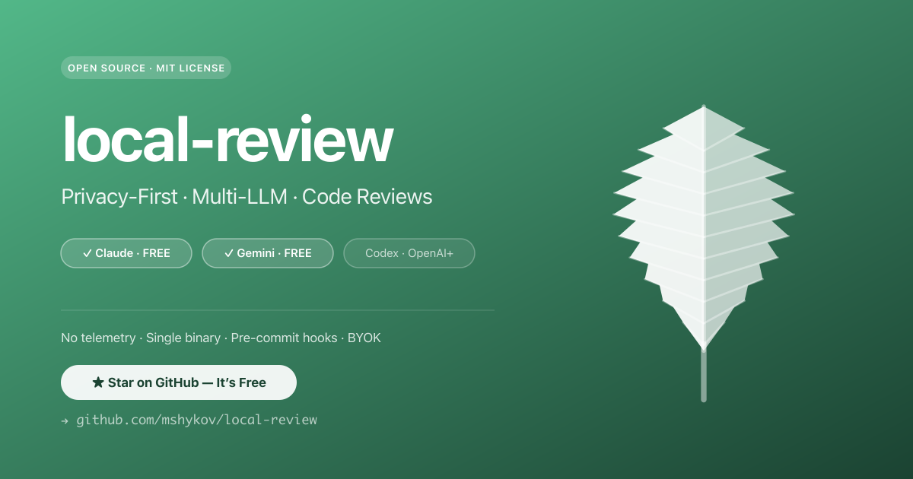

<p align="center">
  
</p>

<h1 align="center">local-review</h1>

<p align="center">
  <strong>Local, BYOK code review for any language.</strong><br>
  Runs against a git diff, hands it to whichever LLM you point it at, prints findings.<br>
  No SaaS, no telemetry, no signup.
</p>

<p align="center">
  <a href="https://github.com/mshykov/local-review/releases"></a>
  <a href="https://github.com/mshykov/local-review/actions/workflows/ci.yml"></a>
  <a href="https://go.dev/"></a>
  <a href="https://github.com/mshykov/local-review/blob/main/LICENSE"></a>
  <a href="https://github.com/mshykov/local-review/stargazers"></a>
  <a href="https://sonarcloud.io/summary/new_code?id=mshykov_local-review"></a>
</p>

<p align="center">
  <a href="#why-local-review">Why</a> •
  <a href="#how-good-is-it">How good is it?</a> •
  <a href="#get-started">Get started</a> •
  <a href="CHECKLIST.md">Checklist</a> •
  <a href="#customise-for-your-team">Customise</a> •
  <a href="https://local-review.shykov.dev">Website</a>
</p>

<p align="center">
  If local-review saves you a review round, <a href="https://github.com/mshykov/local-review/stargazers">star the repo</a> and <a href="https://github.com/mshykov/local-review/discussions">join the discussion</a>.
</p>

---

## Why local-review

Reviewer tools today are mostly **SaaS** (your code leaves the building), **CI-only** (you find out about issues after pushing), **vendor-locked** (OpenAI-only or Anthropic-only), and **runtime-heavy** (Node/Python install required). local-review is the opposite: a single static binary that runs locally on a diff, sends that diff to whichever LLM(s) you've authenticated, and prints findings. Privacy posture depends on which LLM(s) you point it at — see [Privacy](#privacy) below. **Run with Ollama for fully-offline review.**

## What it is, what it isn't

| ✅ What it **is** | ❌ What it **isn't** |
| --- | --- |
| A local CLI that reviews a git diff using LLMs you've already authenticated | A replacement for Claude's `/review` or `/simplify` — those are single-prompt commands; this is multi-LLM diff orchestration |
| An orchestrator that runs Claude / Gemini / Codex / Copilot CLIs in parallel and merges findings into one report | "Code never leaves your machine" — the diff still goes to whichever LLM you authenticate (run Ollama for true offline) |
| BYOK — your API key, requests go direct to the vendor (no middleman server) | A SaaS — no hosted dashboard, no account, no team collaboration features |
| A pre-commit gate — exits non-zero on `major` / `critical` findings so hooks can block the commit | A linter or static analyzer — it's LLM-based, with the heuristic tradeoffs that implies |
| A single Go binary — no Node, no Python, no Docker, no telemetry | A chat interface — reads a diff, prints findings, exits |
| Reads auth state from local files only (`~/.claude/sessions/`, env vars, etc.) to detect login readiness — never transmits credentials | A keychain scraper or credential-exfil tool — auth files are read locally, never sent anywhere |

## How good is it?

The honest answer to "should I trust this tool?" lives in [**`bench/RESULTS.md`**](bench/RESULTS.md) — a committed leaderboard, regenerated and refreshed before each release. It tracks, on a labelled 10-case dataset spanning Go / TS / Python / Rust:

- **Quality.** Precision, recall, F1, and noise-rate-on-clean-diffs per LLM.
- **Uplift over a raw-LLM baseline.** Same case, same model, generic prompt vs. the full local-review pipeline. Answers: "is the tool actually better than typing the diff into Claude.app cold?"
- **Overhead vs the raw-LLM baseline.** Extra seconds + extra tokens per review that the tool costs you on top of the raw model. So you can decide whether the quality uplift is worth the spend.
- **Consistency.** Jaccard agreement across repeated runs of the same case — how stable the verdict is.
- **Per-language splits.** Tightening the Go pack shouldn't be averaged away by the TS scores; the leaderboard keeps them separated.

No marketing numbers in this README — they'd go stale. Read [`bench/RESULTS.md`](bench/RESULTS.md) for the current state, and [`bench/README.md`](bench/README.md) for the methodology.

**Deep-codebase audit dogfood.** v0.10.0 added a second trust artifact: [`audit/`](audit/) — `local-review audit --topic <security|tech-debt>` run against this repo's own committed source tree, output committed. Same shape as `bench/RESULTS.md` (raw output preserved so you can read it before adopting), but answers a different question: *what does diff-time review miss?* See [`audit/README.md`](audit/README.md) for methodology, [`audit/security.md`](audit/security.md) and [`audit/tech-debt.md`](audit/tech-debt.md) for the latest runs.

---

## Get started

**1. Install.** Single binary, no Node/Python/Docker:

```sh
brew install mshykov/tap/local-review
```

Or

```sh
curl -fsSL --proto '=https' --proto-redir '=https' https://raw.githubusercontent.com/mshykov/local-review/main/install.sh | sh
```

Or

```sh
go install github.com/mshykov/local-review/cmd/local-review@latest
```

Or grab a binary from [Releases](https://github.com/mshykov/local-review/releases).

**2. Authenticate at least one LLM.** Claude is the easiest free option:

```sh
npm install -g @anthropic-ai/claude-code
claude login
```

Or use Codex (ChatGPT Plus / OpenAI API), Copilot (GitHub Copilot subscription), or Gemini (free key — *sunset 2026-06-18; v0.15+ auto-disables in the fan-out on/after the cutoff*). Any combination works — every authenticated CLI joins the review automatically. `local-review doctor` shows the state.

**Want a local-only or hybrid setup?** Add a provider entry under `llms.<name>:` with a `base_url:` pointing at any OpenAI-compatible endpoint (Ollama / vLLM / OpenAI / Anthropic / Mistral / DeepSeek / Kimi / Qwen / Together / Groq / OpenRouter). It runs alongside the CLI agents in the same fan-out — no separate config path:

```yaml
# Append to ~/.local-review.yml — Ollama as one more agent
llms:
  ollama:
    base_url: http://localhost:11434/v1
    model: qwen2.5-coder:7b
```

Run `local-review doctor` after editing to confirm the provider shows up as `✓ ollama provider ready`.

**3. (Optional) Add a `.local-review.yml` to your repo** for house rules:

```yaml
# .local-review.yml — every field is optional
prompts:
  prepend: |
    Additional house rules:
    - Never approve commented-out code.
    - Flag any new dependency in package.json or go.mod.
review:
  min_severity: warning   # nit | info | warning | major | critical
```

You can ship the whole pack of overrides this way — see [Customise for your team](#customise-for-your-team) below.

> **Security: a repo's `.local-review.yml` is untrusted by default.** Because it ships inside code you might be reviewing for the first time, the execution / network / secret fields — `llms.<name>.cli_path` (runs a binary), `base_url` (sends your diff to a server), and `api_key` — are **ignored when they come from the repo config**, with a warning. House-rules fields (`prompts`, `review`, model/timeout) still apply. Put `cli_path` / `base_url` / `api_key` in your own `~/.local-review.yml` instead, or — if you genuinely trust the repo (e.g. a team-standardised LAN Ollama endpoint) — set `LOCAL_REVIEW_TRUST_REPO_CONFIG=1`.

**4. Review your current branch** vs `main`:

```sh
local-review review
```

Findings print to your terminal. The tool exits non-zero on `major` / `critical`, so it slots straight into a pre-commit hook.

**5. (Optional) Check how the LLMs score on a labelled benchmark.** The repo ships with [`bench/RESULTS.md`](bench/RESULTS.md) — a leaderboard (precision / recall / F1 / noise, plus uplift-over-raw-LLM and overhead-vs-raw-LLM tables) generated from a 10-case dataset spanning Go / TS / Python / Rust. Refreshed before each release; you don't need to run anything locally. See [`bench/README.md`](bench/README.md) for methodology.

---

## Just want the checklist?

Every check `local-review` applies is published as a human-readable [**CHECKLIST.md**](CHECKLIST.md) — OWASP-2025-aligned, with severity tiers and concrete measurables. Paste it into your team wiki, run reviews manually against it, or use `local-review review` to get an LLM pass against the same rules. Either path; both work.

## Customise for your team

Three knobs in `.local-review.yml` let you tune review tone, severity bar, or add house rules — **without forking the binary**:

```yaml
prompts:
  pack_dir: .local-review/prompts   # per-language overrides; <language>.md replaces the embedded pack
  prepend: |                        # spliced before every pack body
    Additional house rules: ...
  append: |                         # spliced after every pack body
    Output language: English only.
```

All three apply uniformly across CLI agents and provider endpoints in the fan-out, so customizations reach every reviewer. `--prompt-pack-dir <dir>` overrides for one-off runs. Full details in [Customise the review prompt](#customise-the-review-prompt-v08) below.

---

> ✨ **What's new in v0.12.** A new reviewer and a clear migration path off the dying Gemini CLI:
>
> - **GitHub Copilot CLI joins the fan-out.** `copilot` is now a first-class reviewer alongside Claude / Gemini / Codex — `copilot login` (or a `COPILOT_GITHUB_TOKEN`) and it joins automatically. We run it tools-disabled (`--available-tools=`) so a prompt-injecting diff can't drive its shell/write tools; each run costs one Copilot Premium request.
> - **Antigravity (`agy`) detection + Gemini deprecation (v0.11).** `local-review doctor` detects Google's Gemini-CLI successor `agy` and flags Gemini as deprecated (stops serving **2026-06-18**) with a migration notice. Caveat: `agy` is **detected but not yet a reviewer** — its headless `--print` runs an autonomous agent loop instead of returning a clean review, so it's gated out as `◐ experimental` until a structured-output contract lands.
>
> **Plus the v0.10.x themes** (six patches since v0.9):
>
> - **Whole-codebase audit.** New `local-review audit --topic <security|tech-debt>` walks every tracked file, groups by package, and runs each chunk through the LLM with a topic-specific prompt. Surfaces accumulated issues no diff-time review would catch. Reports committed under [`audit/`](audit/) as a second trust artifact next to [`bench/RESULTS.md`](bench/RESULTS.md). See `local-review audit --topic security --dry-run` to preview cost before paying tokens.
> - **Pre-flight LLM readiness probe.** Before fanning out to every LLM, `local-review review` now issues a tiny `Reply OK` probe per agent with a 10s timeout. Printed as a ✓/✗ block at the top of the run — and when an LLM times out, the probe surfaces the vendor's actual diagnostic (`gemini ✗ timeout after 10s — Error: You have exhausted your capacity on this model.`) instead of leaving you to guess. `--no-preflight` opts out for CI/scripting.
> - **Swift / Kotlin / Liquid prompt packs.** Activates automatically on `.swift`, `.kt`, `.kts`, `.liquid` files. Same shape as the existing Go / TS / Python / Rust packs (language-specific pitfalls, security, idioms).
> - **`bench --swe-bench`** — catch-rate measurements against bug-introducing diffs from the SWE-bench-lite dataset (real bugs from projects we didn't author). New section in [`bench/RESULTS.md`](bench/RESULTS.md) alongside the existing F1 leaderboard.
> - **Ollama on a LAN host works without dummy api_key.** Point `llms.<name>.base_url` at `http://192.168.x.x:11434/v1` and it Just Works — RFC1918 + IPv6 ULA / link-local hosts are treated as auth-free. Corporate-gateway invariant preserved (set `llms.<name>.api_key_env` if your LAN endpoint authenticates). Tailscale CGNAT (`100.64.0.0/10`) added in v0.13.0.
> - **`install.sh` prompts before skipping checksum verification when a TTY is available.** Closes the env-var-only-opt-out gap the v0.10.0 audit dogfood flagged.
>
> Full notes in [CHANGELOG](CHANGELOG.md). The session pattern worth noting: every v0.10.x release was driven by either the previous release's `audit/` output or by reviewers (3-LLM / Copilot / CodeRabbit) catching real findings inside the PR. The multi-reviewer redundancy IS the trust signal.

---

## Multi-agent is the default (v0.14+)

**Every authenticated LLM CLI AND every reachable provider endpoint runs by default.** No opt-in, no enabling — if you `claude login`, claude runs. If you `export OPENAI_API_KEY=...`, codex runs. If you add a `llms.ollama.base_url: http://localhost:11434/v1` entry to your config, the Ollama provider runs alongside the CLIs. If an agent isn't authenticated / reachable, it's silently skipped.

```sh
# Default: all active agents (CLI + provider)
local-review review

# Restrict to a subset (overrides config)
local-review review --only claude,ollama

# Pick a specific model for one CLI agent
local-review review --claude-model claude-opus-4-7

# Use a specific agent to do the merge
local-review review --merge-with claude

# Audit (single-LLM by design) — pin the agent that handles it
local-review audit --topic security --with ollama
```

### Supported LLMs

| LLM | Free Option | Installation |
|-----|-------------|--------------|
| **Claude** | ✅ Free tier via `claude login` (claude.ai account) | `npm install -g @anthropic-ai/claude-code` |
| **Gemini** *(sunset 2026-06-18 — v0.15+ auto-disables)* | ✅ Free API key from [Google AI Studio](https://aistudio.google.com/apikey) | `npm install -g @google/gemini-cli` |
| **Codex** | ⚠️ ChatGPT Plus ($20/mo) **or** OpenAI API key (pay-per-token) | `npm install -g @openai/codex` |
| **Copilot** | ⚠️ GitHub Copilot subscription (one Premium request per run) | `npm install -g @github/copilot` |
| **Antigravity** *(detected — review integration experimental)* | Google OAuth (`agy` login) | `curl -fsSL https://antigravity.google/cli/install.sh \| bash` (binary: `agy`) |

> **Gemini sunset 2026-06-18.** Google's Gemini CLI stops serving Pro/Ultra/free-tier requests on this date. **v0.15+ handles this automatically**: pre-sunset `doctor` shows a live countdown banner ("N days until sunset"); on/after the cutoff, gemini is auto-disabled in the review fan-out with a clear note. Want to keep trying past the cutoff (in case Google extends, or your network sees a different rollout)? Set `llms.gemini.force_after_sunset: true` to opt back in. Antigravity (`agy`) is Google's announced successor and `local-review doctor` detects it as *experimental* — its headless `--print` mode runs an autonomous agent loop (explores the repo, rebuilds its own diff, emits step-narration) instead of returning a clean review, so it isn't yet in the fan-out. Until that lands, keep using Gemini (until the cutoff) or any of the other CLIs / providers.

**How it works:**
1. Detects installed LLM CLIs and which are authenticated (`local-review doctor`)
2. **Pre-flight probe** — issues a tiny `Reply OK` call per LLM (10s timeout) before the real fan-out. Surfaces auth / capacity / network issues as `✓`/`✗` in seconds, with the vendor's actual error inline on timeout. Skips ✗ agents from the real run.
3. Runs every surviving authenticated CLI in parallel
4. Saves each review to `.local-review/reviews/<branch>/<commit>_<llm>_<version>.md`
5. Merges findings (dedup, consensus tagging) into one report
6. Prints the merged report to stdout (also saved as `<commit>_merged.md`)

**Expected output shape** (with the v0.10.x pre-flight block):

```
Reviewing feature/foo (abc1234) with 3 LLMs...
  • claude_claude-haiku-4-5 (CLI v2.1.149) | timeout: 600s
  • gemini_gemini-2.5-pro (CLI v0.43.0) | timeout: 600s
  • codex_gpt-5.3-codex (CLI v0.133.0) | timeout: 600s

Pre-flight (probing auth + capacity):
  claude   ✓ (3.5s)
  gemini   ✗ timeout after 10s — Error: You have exhausted your capacity on this model.
  codex    ✓ (2.5s)
Probed 3 LLMs in 10s.

claude ✓ (58s) · 80.8k in / 5.4k out
codex ✓ (1m12s) · 67.6k total

Merging reviews...
Using claude for merge...
✓ Merged review (12.8s)

─── Findings ───
# Code Review — Consolidated Report
... merged markdown ...
─── End ───

✓ 2/3 LLMs produced output · total 1m32s · ~206k tokens
Merged report: .local-review/reviews/feature-foo/abc1234_merged.md
```

The probe gives you back the time the v0.10.0 build spent waiting on doomed LLMs — a ~4-minute gemini hang becomes a sub-10-second skip with the actual reason inline.

`--no-preflight` skips the probe phase. Use it in CI / non-interactive contexts where you don't mind the original v0.10.0 wait-and-see behaviour, or when the probe's tiny token cost matters.

**Authentication — what each LLM needs:**

| LLM | Default (preferred) | Alternative |
|---|---|---|
| **Claude** | `claude login` — Anthropic OAuth, works with the free tier on a claude.ai account | `export ANTHROPIC_API_KEY=...` (paid API access) |
| **Gemini** *(deprecated — stops serving 2026-06-18)* | `export GEMINI_API_KEY=...` — free key from [Google AI Studio](https://aistudio.google.com/apikey) | `gemini /auth` for Google OAuth |
| **Codex** | `codex login` — uses your ChatGPT Plus subscription ($20/mo) | `export OPENAI_API_KEY=...` — pay-per-token; usually **cheaper** for occasional review use |
| **Copilot** | `copilot login` — uses your GitHub Copilot subscription | `export COPILOT_GITHUB_TOKEN=...` (headless / CI). A bare `GH_TOKEN` / `GITHUB_TOKEN` works for the `copilot` CLI itself but **won't auto-enable** this paid reviewer — set the Copilot-specific token or log in. |

Run `local-review doctor` to see which CLIs you have installed and authenticated. Each row that isn't ✓ ready tells you exactly what to fix.

**Configuration is optional.** If `~/.local-review.yml` or `./.local-review.yml` exists it overrides defaults; CLI flags override config:

```yaml
# .local-review.yml — example: mix CLI agents with a local Ollama provider
llms:
  # CLI agents — names are well-known (claude / codex / copilot / gemini).
  # Just set the per-agent knobs you care about; auto-detection handles the rest.
  claude:
    model: claude-opus-4-7

  codex:
    enabled: false           # opt-out (still runs if --only codex is passed)

  gemini:
    model: gemini-2.0-flash
    # llms.gemini.force_after_sunset: true   # uncomment to keep trying past 2026-06-18

  # Provider agents — ANY entry under `llms:` with a `base_url:` becomes an
  # HTTP provider agent (Ollama / vLLM / OpenAI-compat). Name is free-form.
  ollama:
    base_url: http://localhost:11434/v1
    model: qwen2.5-coder:7b

merge:
  preferred_llm: auto        # or: claude, codex, copilot, ollama, ...
```

See [`examples/.local-review.yml`](examples/.local-review.yml) for full schema.

**Three common shapes:**

```yaml
# Shape A — fully local (offline, no cloud calls)
llms:
  ollama:
    base_url: http://localhost:11434/v1
    model: qwen2.5-coder:7b
  claude:  { enabled: false }
  codex:   { enabled: false }
  gemini:  { enabled: false }
  copilot: { enabled: false }
```

```yaml
# Shape B — cloud-only multi-agent (default for a fresh install with CLIs authenticated)
# No config file needed — every authenticated CLI runs automatically.
```

```yaml
# Shape C — hybrid (CLIs + a local Ollama for fast iteration / cost smoothing)
llms:
  ollama:
    base_url: http://localhost:11434/v1
    model: qwen2.5-coder:7b
  # claude / codex / copilot / gemini auto-detected, no need to list them
```

## Audit — whole-codebase deep analysis (v0.10+)

`local-review review` operates on a diff. **`local-review audit` operates on the whole committed tree** — surfacing pre-existing issues no diff-time review would catch (accumulated security gaps, dead code, duplicated logic, leaky abstractions). Topic-driven and opt-in; pick a focus per run.

```sh
local-review audit --topic security    # OWASP-aligned sweep
local-review audit --topic tech-debt   # dead code, duplication, leaky abstractions
```

How it works:

1. `git ls-files` walks every tracked source file.
2. Files are grouped by directory into chunks (one per package). Packages above the per-chunk cap (96 KiB by default) auto-split into `pkg [part N/M]` sub-chunks preserving file adjacency.
3. Each chunk goes to the LLM with the topic's audit pack as the system prompt (audit packs deliberately skip the `nit` severity tier — whole-codebase reading produces enough signal that nits dilute the report).
4. Findings merged into one report; emit text/markdown/JSON.

**Preview cost before paying tokens:**

```sh
local-review audit --topic security --dry-run
```

Prints the chunk plan (count, file count per chunk, total bytes) without invoking the LLM. Useful for the first audit of an unfamiliar codebase.

**Save the report:**

```sh
local-review audit --topic security --out audit/security.md
local-review audit --topic tech-debt --out audit/tech-debt.md
```

Single-LLM in v1 — picks the first authenticated agent (claude when available) unless you pin one with `--with <agent>` (any CLI or provider name from `local-review doctor`). Audit cost is per-package × per-topic; running multi-LLM would multiply spend without obvious quality return.

This project audits itself: [`audit/security.md`](audit/security.md) and [`audit/tech-debt.md`](audit/tech-debt.md) are the live reports the tool produced on its own source tree. They're the trust artifact for `audit` the way [`bench/RESULTS.md`](bench/RESULTS.md) is for `review`. See [`audit/README.md`](audit/README.md) for methodology + how to triage findings.

## Configure

local-review loads YAML from a cascade — built-in defaults → `~/.local-review.yml` → `./.local-review.yml` → CLI flags.

A minimal `~/.local-review.yml` (unified shape, v0.14+):

```yaml
llms:
  ollama:                              # any name you like — "ollama", "qwen", "cloud", ...
    base_url: http://localhost:11434/v1
    model: qwen2.5-coder:7b
review:
  min_severity: warning
  max_findings: 20
```

Any entry under `llms:` with a `base_url:` becomes a **provider agent** — an OpenAI-compatible HTTP endpoint (Ollama, vLLM, OpenAI, Anthropic, Mistral, DeepSeek, Kimi, Qwen, Together, Groq, OpenRouter). Provider agents run side-by-side with the CLI agents (`claude`, `codex`, `gemini`, `copilot`) in the same `local-review review` fan-out — no separate single-LLM-fallback path.

> **Removed in v0.15:** the top-level `provider:` block (the v0 single-LLM-fallback mode). Loading a YAML file that still carries a `provider:` key now surfaces a migration error pointing at this shape. The migration is a verbatim field-rename — `provider.base_url` → `llms.<your-name>.base_url`, same for `model` / `api_key_env`. (Deprecated in v0.14, removed in v0.15; the CHANGELOG carries the full migration snippet.)

See [`examples/.local-review.yml`](examples/.local-review.yml) for the full annotated example.

### Switching providers

Every provider entry lives under `llms.<your-name>:` with `base_url` / `model` / `api_key_env` fields (v0.14 unified-agent model; v0 top-level `provider:` block removed in v0.15). local-review speaks the OpenAI chat-completions API — every major provider supports it:

| Provider | `base_url` | Notes |
|---|---|---|
| OpenAI | `https://api.openai.com/v1` | Default. `gpt-4o-mini` is cheap; `gpt-4o` for harder reviews. |
| Anthropic | `https://api.anthropic.com/v1` | Anthropic's [OpenAI-compatible endpoint](https://docs.anthropic.com/en/api/openai-sdk). Use exact model names (e.g. `claude-sonnet-4-6`, `claude-opus-4-7`). |
| Mistral | `https://api.mistral.ai/v1` | EU-hosted; Codestral is code-tuned. |
| DeepSeek | `https://api.deepseek.com/v1` | Cheapest cloud option. |
| Groq | `https://api.groq.com/openai/v1` | Fast inference; Llama, Qwen, etc. |
| Together | `https://api.together.xyz/v1` | Llama, Mixtral, Qwen — many open-weights options. |
| OpenRouter | `https://openrouter.ai/api/v1` | One key, all models. |
| Ollama | `http://localhost:11434/v1` | **Fully offline.** No data leaves your machine. |
| Ollama on a LAN host | `http://192.168.1.50:11434/v1` *(or any RFC1918 IP)* | **Stays on your network.** Same as local Ollama for one machine, but with the model server on a separate box (typically a GPU host). Set `OLLAMA_HOST=0.0.0.0:11434` on the server so it accepts connections beyond loopback. local-review treats RFC1918 / link-local / IPv6 ULA hosts as auth-free by default (see `isLocalURL`); set `llms.<name>.api_key_env` explicitly if your LAN gateway DOES authenticate. |
| vLLM | `http://your-host/v1` | Self-hosted. |

The fastest way to set any of these up is `local-review init`, which writes a working `.local-review.yml` from a preset.

## Pre-commit hook

```sh
cp examples/pre-commit .git/hooks/pre-commit
chmod +x .git/hooks/pre-commit
```

Or with [husky](https://typicode.github.io/husky/) / [lefthook](https://github.com/evilmartians/lefthook): run `local-review staged` in the `pre-commit` step.

Bypass for emergencies: `LOCAL_REVIEW_SKIP=1 git commit ...`.

## CLI

```
# Review (multi-agent: every authenticated CLI + every reachable provider endpoint runs in parallel)
local-review review [<base>]         # canonical: current branch vs <base> (default: main)
local-review staged                  # review git diff --cached (pre-commit)
local-review commit [<rev>]          # review one commit (default: HEAD)
local-review branch [<base>]         # alias of `review` for muscle-memory

# Audit — whole-codebase deep analysis (v0.10+)
local-review audit --topic security      # OWASP-aligned sweep
local-review audit --topic tech-debt     # dead code, duplication, leaky abstractions

# Utilities
local-review init                    # interactive setup (writes .local-review.yml)
local-review doctor                  # check LLM installations + auth state
local-review config                  # print resolved config (API keys masked)
local-review version                 # print version
```

Common flags (review):

| Flag | Purpose |
|---|---|
| `--only <list>` | Comma-separated agents to run (e.g. `claude,gemini`); overrides config |
| `--claude-model <id>` | Override claude's model (same for `--gemini-model`, `--codex-model`, `--copilot-model`) |
| `--merge-with <agent>` | Pick which agent merges findings (default: auto) |
| `--no-preflight` | Skip the pre-flight readiness probe; go straight to the real fan-out (v0.10.1+). Use in CI / non-interactive scripts where the ~10s probe budget isn't worth it. |
| `--min-severity <tier>` | `nit` / `info` / `warning` / `major` / `critical` — honoured by `audit` and `bench`; ignored on `review` (multi-agent filtering happens inside the merge prompt). |
| `--max-findings <n>` | Cap output — honoured by `audit` and `bench`; ignored on `review`. |
| `--json` | Emit JSON. Honoured by `audit` and `bench` (output goes to stdout); ignored on `review` (the merged report is markdown). |

In `review` mode the merger returns markdown, not structured findings, so `--json`, `--min-severity`, and `--max-findings` are **ignored**: multi-LLM trimming happens inside the merge prompt instead. The audit and bench paths still honour all three flags. Multi-LLM emits a stderr warning when those review-shape flags are passed so you know they had no effect. A structured-JSON multi-LLM review mode (where the merger emits both markdown and a JSON envelope) is on the roadmap — no fixed date.

Audit-specific flags:

| Flag | Purpose |
|---|---|
| `--topic <id>` | **Required.** `security` or `tech-debt`. |
| `--out <path>` | Write the report to a file (`.md` → markdown, `.json` → JSON). Without `--out`, the report prints to stdout. |
| `--dry-run` | Print the chunk plan (file count + size per package, total bytes) without invoking the LLM. Preview cost before paying tokens. |
| `--include <prefixes>` | Comma-separated path prefixes to include (default: all auditable tracked files) |
| `--exclude <prefixes>` | Comma-separated path prefixes to exclude |
| `--max-bytes-per-chunk <N>` | Per-chunk input cap; packages above the cap auto-split into `pkg [part N/M]` sub-chunks (default: 96 KiB) |
| `--with <agent>` | Pin the audit to a specific agent — any name from `local-review doctor`'s ready list, CLI (`claude`, `codex`, …) or provider (`qwen`, `local-fast`, …). Default: first authenticated agent. Single-valued. |

The root-level `--json` flag is honoured by `audit` (emits the report as JSON on stdout) and by `bench` (same shape). It's only ignored by multi-LLM `review`, per the paragraph above.

Config wins by default; flags override config at runtime (e.g., `--only codex` runs codex even if your config sets `codex.enabled: false`).

Exit codes:

- `0` — no blocking findings
- `2` — `major` or `critical` findings present (pre-commit gate)
- non-zero — local-review itself failed (the hook ignores this and lets the commit through)

## Prompt packs

local-review ships with packs for `default`, `typescript`, `go`, `python`, `rust`, `swift`, `kotlin`, and `liquid`, with more coming. The CLI auto-picks based on the dominant language in your diff. Force a specific pack with `review.prompt_pack: <id>` in your YAML config.

Each pack is a markdown file (in [`internal/prompts/packs/`](internal/prompts/packs/)) that defines:
- What to look for (priority-ordered)
- Severity tiering rules
- Hard rules ("never invent code that isn't in the diff")
- Output JSON schema

See [`docs/prompt-packs.md`](docs/prompt-packs.md) for how to write or override one.

### Customise the review prompt (v0.8+)

Different teams have different opinions about what's a "warning" vs a "nit." Forking the binary to change the bundled packs is a heavy hammer. Three lighter knobs in `.local-review.yml`:

```yaml
prompts:
  # 1. Per-language override directory. A `<language>.md` file here
  #    replaces the embedded pack of the same name. Missing files
  #    fall through to the embedded pack — partial overrides are
  #    fine.
  pack_dir: .local-review/prompts

  # 2. Inline rules spliced BEFORE every pack body. Use for house
  #    rules that should colour the entire review.
  prepend: |
    Additional house rules:
    - Never approve commented-out code.
    - Flag any new dependency in package.json or go.mod.

  # 3. Inline rules spliced AFTER every pack body. Use for output-
  #    shape rules the LLM should see last.
  append: |
    Output language: English only.
```

All three apply uniformly to every active agent (claude, codex, copilot, gemini, plus any `llms.<name>` provider endpoints), so a team's customizations reach every reviewer.

For one-off runs, `--prompt-pack-dir <dir>` overrides `prompts.pack_dir` for a single review without touching the YAML.

`local-review config` shows where each language's prompt actually came from:

```text
# Resolved prompt sources:
#   default      embedded
#   go           /Users/me/repo/.local-review/prompts/go.md
#   python       embedded+prepend
#   rust         embedded
#   typescript   embedded
```

`local-review doctor` actively probes the prompt configuration and warns on every misconfiguration the resolver tolerates silently: missing `pack_dir`, `pack_dir` pointing at a file (not a directory), `pack_dir` with no `<language>.md` files matching a shipped pack, or known-language override files that exist but aren't readable. The resolver itself stays fall-through-on-error so a transient FS glitch can't kill every review; doctor surfaces the same conditions once at setup-check time.

## What it does NOT do (yet)

- **No multi-file refactor reasoning.** local-review reviews diffs, not architectures.
- **No auto-fix / auto-PR.** Findings are advisory.
- **No GitHub integration in the binary.** The `--json` output is structured for piping into your CI's PR-comment tool of choice. A native `local-review github` mode is parked — open an issue if you need it.
- **No telemetry.** None. Ever.

### On the roadmap

These are queued and will land in priority order; ping the issue tracker if you want to influence the sequence.

1. **Org-config fetching** *(near-term)* — an `org:` block in your `.local-review.yml` (with a `config_url:` field) will fetch + cache an org-wide policy YAML, so a team can ship a single repo-local config that pulls org defaults from a central URL. Example shape:
   ```yaml
   org:
     config_url: https://your-internal-host/local-review.yml
   ```
2. **Structured JSON multi-LLM output** — the merger will emit markdown plus a JSON envelope so CI integrations don't have to text-scrape. Demand-pull: open an issue if you need it.
3. **Cosign release signing** — `install.sh` already verifies SHA-256 checksums (defense against accidental corruption + basic tampering). Cosign signatures will add stronger supply-chain provenance: every release tarball signed via keyless OIDC at build time, verified by the installer against the GitHub Actions identity. Useful for enterprise installs that need to prove an artifact came from this repo's release pipeline and wasn't swapped at the channel/CDN layer.

## For organizations

Distributing to a few hundred engineers? Two patterns work:

1. **Org config repo.** Drop a `.local-review.yml` in each project that sets:
   ```yaml
   org:
     config_url: https://your-internal-host/local-review.yml
   ```
   (Org-config fetching is the next planned feature — see "On the roadmap" above; today, just commit the YAML to each repo.)
2. **One install command in onboarding.** `curl -fsSL <install.sh> | sh` plus an env var = done.

## Privacy

**local-review is telemetry-free**: no analytics, no auto-update calls, no signup, no SaaS. The only network traffic is to the LLM endpoint(s) *you* configure — every authenticated CLI calls its own backend as a subprocess, every `llms.<name>.base_url` entry hits the HTTP endpoint you configured. What "private" means therefore depends on which agents you point it at:

| Configuration | Where your diff goes |
|---|---|
| **Provider agent only** — a single `llms.ollama.base_url: http://localhost:11434/v1` (or any local-only endpoint), every CLI agent `enabled: false` | **Stays on your machine.** Fully offline. |
| **Provider agent only** against a cloud endpoint (`llms.openai.base_url: https://api.openai.com/v1`, every CLI agent `enabled: false`) | The provider you configured, over TLS. Their privacy policy applies. |
| **Multi-agent (default)** — every authenticated CLI (claude / codex / copilot / gemini) AND every reachable provider endpoint | **Each authenticated CLI calls its own backend** (Anthropic, Google AI, OpenAI, GitHub) and each provider hits the endpoint you configured. One review fans out to multiple vendors in parallel. |
| Multi-agent with `--only ollama` (or any other local-only agent name) | **Stays on your machine** for that run. The other agents are gated out by the explicit allow-list. |

If you need air-gapped review today, configure a single `llms.ollama:` entry pointing at a local (or LAN / Tailscale) Ollama, set every CLI agent `enabled: false`, and run `local-review review`. The fan-out resolves to just the one provider agent — no cloud calls. Or use `--only <name>` ad-hoc to lock a single run to your local agent.

## Develop

```sh
go test ./...
go build -o local-review ./cmd/local-review
./local-review staged
```

See [CONTRIBUTING.md](CONTRIBUTING.md).

## License

MIT. See [LICENSE](LICENSE).
